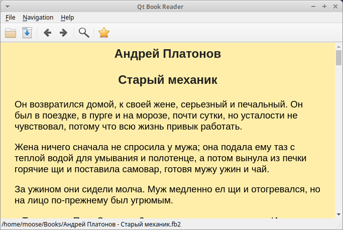

# Qt Book Reader #

## Russian ##
Простая читалка электронных книг, написанная на C++ с использованием тулкита Qt5.

В настоящий момент поддерживаются следующие форматы:
* FictionBook 2.0 (fb2)
* FictionBook 3.9 (fb3)
* Comics Book Zip (cbz)

Сборка на Ubuntu 20.04:
1. Склонировать репозиторий
2. sudo apt install qt5-qmake qt5-default qtwebengine5-dev libquazip5-dev build-essential
3. mkdir -p build && cd build && qmake .. && make

## English ##
Simple book reader, written on C++ with Qt5 toolkit.

For now support the next file formats:
* FictionBook 2.0 (fb2)
* FictionBook 3.0 (fb3)
* Comics Book Zip (cbz)

Build on Ubuntu 20.04:
1. Clone this repository
2. sudo apt install qt5-qmake qt5-default qtwebengine5-dev libquazip5-dev build-essential
3. mkdir -p build && cd build && qmake .. && make

